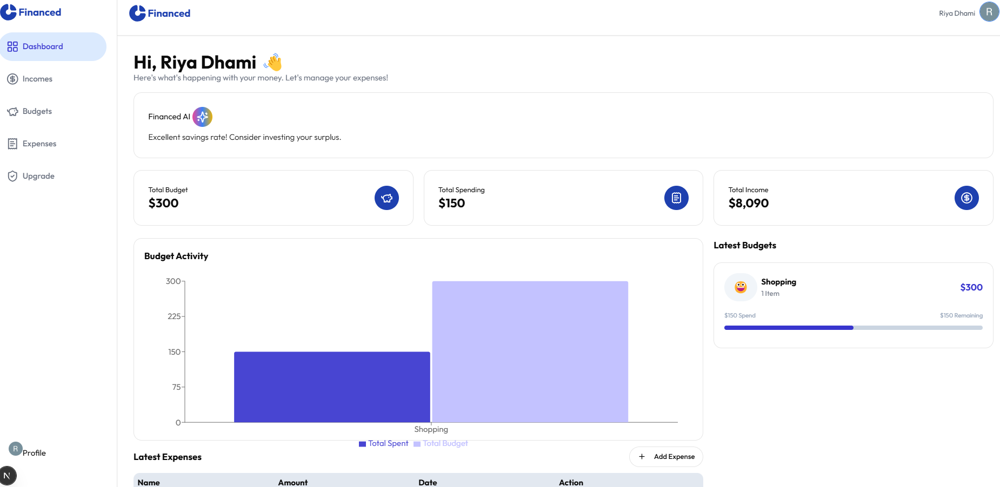

# 💰 Financed : AI-Powered Financial Dashboard

Financed is a financial tracker app that helps you manage and track your entire finances, powered by an AI system called Financed AI, which generates insightful summaries based on your financial data. This web application is built using Next.js, Tailwind CSS, and Framer Motion, offering a seamless and user-friendly experience. It was designed keeping in mind individuals who find managing finances tedious, in hopes to make the financial journey simpler and enjoyable.
> 🚀 **Tech Stack**: Next.js, Tailwind CSS, Framer Motion, React Icons, TypeScript



---

## ✨ Key Features

- **Smooth, Scroll-Based Interaction**  
  Interactive scroll effects and transitions that bring the dashboard to life, creating a modern and engaging browsing experience without overwhelming the user.

- **Fully Responsive and Mobile-Friendly Design**  
  Designed to work effortlessly across desktops, tablets, and smartphones, ensuring the dashboard looks great and functions smoothly on any screen size.

- **AI-Ready Financial Dashboard**  
  A flexible dashboard layout built with Open AI integration that delivers personalized insights, recommendations, and visual reports based on user data.

- **Modular and Easy-to-Customize Components**  
  Built with reusable components, making it easy to add new features, make changes, or adjust the design to fit different types of users.


---

###  Prerequisites

- **Node.js** (v16 or higher recommended)
- **npm** or **yarn** (package managers)

---

### Installation

1. **Clone the repository**:
   ```bash
   git clone https://github.com/your-username/financial-advisor-dashboard.git
   cd financial-advisor-dashboard
2. **Install dependencies**:
   ```bash
   npm/yarn install
3. **Run the development server**:
   ```bash
   npm run dev / yarn dev
4. Open http://localhost:3000 in your browser to view the app.
   
